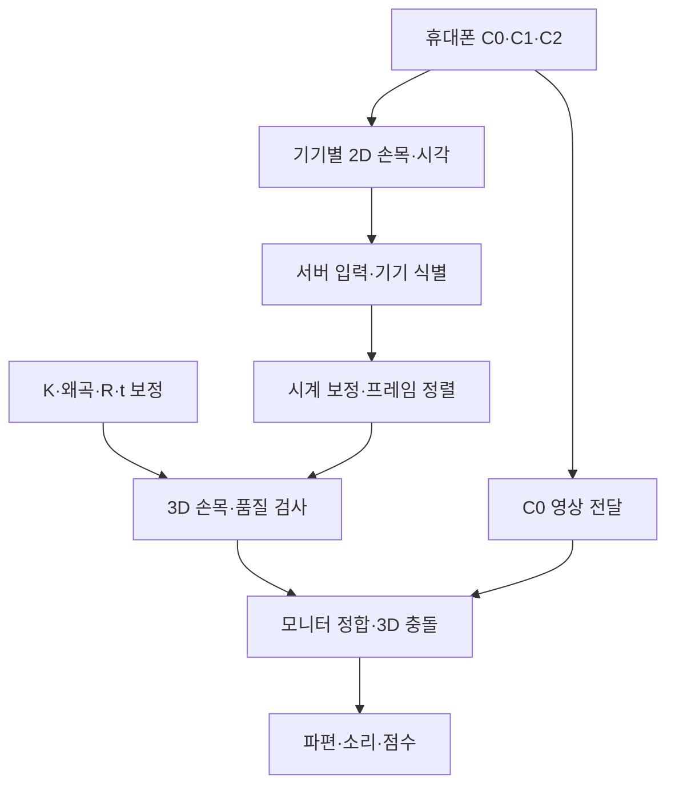

# 구조와 개발 경계

## 목표 데이터 흐름

```mermaid
flowchart TD
  phones["휴대폰 C0·C1·C2"] --> pose["기기별 2D 손목·시각"]
  pose --> ingest["서버 입력·기기 식별"]
  ingest --> sync["시계 보정·프레임 정렬"]
  calib["K·왜곡·R·t 보정"] --> track["3D 손목·품질 검사"]
  sync --> track
  track --> game["모니터 정합·3D 충돌"]
  phones --> video["C0 영상 전달"]
  video --> game
  game --> effect["파편·소리·점수"]
```

폰 추론을 우선 검증하는 작업 가정입니다. 위 흐름은 목표 구조이며 현재 구현 완료를 뜻하지 않습니다. PC 추론을 채택하면 영상 입력·MediaPipe를 `backend/ingest/`에 연결하고 이후 공통 계약은 유지합니다.

## 폴더별 책임

| 경로 | 책임 | 경계를 지키는 규칙 |
| --- | --- | --- |
| `backend/server.py` | HTTP·WebSocket과 정적 화면 제공 | 카메라 루프나 알고리즘을 한 파일에 넣지 않음 |
| `backend/ingest/` | 기기 등록, 입력 검증, 수신, C0 영상 경로 | 미디어와 관절 큐 분리. 연결됐다는 이유로 보정 완료로 표시하지 않음 |
| `backend/calibration/` | 내부·외부 보정, 보정 버전·기기 설정 검증 | 실제 촬영 설정과 맞지 않는 보정 거부 |
| `backend/sync/` | 시계 오프셋·RTT·불확실성, 최신 프레임 정렬 | 폰 로컬 타임스탬프를 서로 바로 비교하지 않음 |
| `backend/tracking/` | 삼각측량, 재투영·깊이·신뢰도 검사 | 단일 시점과 실패 결과는 null |
| `web/camera/` | 카메라 미리보기, 이후 MediaPipe·전송 | 영상 회전·크롭·렌즈 변경을 보정 버전에 연결 |
| `web/monitor/render/` | Three.js, C0 투영, 건물 로드 | 영상과 가상 장면의 픽셀 격자·왜곡 처리 일치 |
| `web/monitor/physics/` | 손목 궤적 충돌, Rapier, 소리 | 건물 변환을 렌더링과 공유하고 추적 실패 시 궤적 초기화 |
| `web/monitor/game/` | 준비, 시작, 60초, 점수, 결과, 리셋 | UI가 관절의 유효 여부를 임의로 바꾸지 않음 |

초기에는 폴더마다 역할 안내를 두었습니다. 아직 구현하지 않은 알고리즘에 성공처럼 동작하는 가짜 함수를 넣지 않았습니다.

## 현재 실행되는 흐름

1. FastAPI가 `/monitor/`와 `/camera/`를 제공합니다.
2. 두 화면이 `/ws/status`로 서버 상태를 받습니다.
3. 카메라 페이지는 버튼을 누르면 카메라를 켜고, 폰에서 MediaPipe로 좌·우 손목을 찾아 화면에 표시합니다.
4. 카메라 페이지는 `/ws/pose`로 `pose_2d`를 보내려 하지만, 서버 수신(T01)은 아직 없어 연결 실패를 표시하고 로컬 표시만 합니다. 서버에는 관절·영상이 도착하지 않으므로 `game_ready=false`를 유지합니다.

## 좌표와 시간

- 월드 좌표: 바닥 기준 원점, X/Y는 바닥, Z는 위, m 단위.
- OpenCV 카메라: +x 오른쪽, +y 아래, +z 전방.
- Three.js 표시 변환: `(X,Y,Z) → (X,Z,-Y)`. 위치와 카메라 외부 파라미터에 같은 기준을 적용합니다.
- 관절 추출 결과는 원본 영상 크기 기준 픽셀입니다. MediaPipe의 정규화 좌표는 원본 폭·높이로 변환합니다.
- 2D 관절은 원본/왜곡 보정 좌표 중 어느 쪽인지 명시합니다. 왜곡을 두 번 제거하지 않습니다.
- 촬영 시각, 추론 종료 시각, 서버 수신 시각은 별도 값입니다. 시간 단위는 ms이며 시계 기준을 필드로 명시합니다.

## C0 영상과 관절을 따로 다루기

관절 메시지만 전송해도 3D 계산은 가능하지만, 모니터에 사용자 모습을 합성하려면 C0 영상 전달 경로가 추가로 필요합니다. C1/C2의 영상 생략 가능 여부를 C0에도 그대로 적용하지 않습니다. 영상 전송 방식은 실제 지연·기기 호환성을 측정해 정합니다.

## 의존성 추가 시점

초기 스타터 화면은 별도 Node 빌드가 없었습니다. 2026-11-03 main 기준 카메라는 로컬 MediaPipe 배포 파일을 사용하며, frontend/fracture의 키보드 데모는 루트 package.json·잠금 파일과 Vite/Three.js/Rapier를 사용합니다. 단일 모드의 새 진입점은 후속 구현 대상입니다. 서버 별도 브랜치의 OpenCV·NumPy 등은 선별 통합 시 의존 버전/검증을 함께 기록합니다. 모델·WASM·필수 에셋은 로컬 제공 경로를 유지합니다.

## 2026-11-03 단일 카메라 추가 구조 제안

[휴대폰 1대·PC 화면 계획](SINGLE_CAMERA_PLAN.md)의 단일 화면 2D 경로를 제안한다. PC 수신 프레임 추론·모드별 준비/세션·2D 이벤트 단위는 설계 검토 대상이며 현재 구현/메시지 스키마가 아니다. 기존 다중 3D의 room_z_up·보정·유효 시점·시간 기준은 유지하고 후속 구현 PR에서 확정·검증한다.

2026-11-03 v0.2 상세화: [인터페이스·상태 기준안](SINGLE_CAMERA_INTERFACES.md)에 PC 생성 세션/서버 ACK, 방/스트림/실행 버전, 프레임·변환·만료, 2D 단위와 수락/거부를 정의했다. [검증 계획](SINGLE_CAMERA_TEST_PLAN.md)의 T-SC-01~18로 후속 구현을 확인한다. 제안 API/파일은 신규 개발 대상이며 현재 스키마·실행 코드에 적용한 변경은 없다.

## 2026-11-03 PC 단일 화면 구현

/monitor/single/은 별도 Vite 진입점이며 [실행/모듈/인계](SINGLE_CAMERA_MONITOR.md)를 따른다. 프레임·표시·정상 건물 목표·게임 소비자를 구현했고 기존 키보드는 공용 GameController/fragment-bodies를 재사용한다. 단일 live 경로는 아직 없는 신호 서버/추론 연결을 요구해 시작을 차단한다. synthetic은 명시 선택한 로컬 시험이며 글로벌 다중3D 준비 상태에 영향을 주지 않는다.
